# TP13 — My Docker Project

## What this project is about

For this TP I had to build a complete Docker stack around a Node.js API. The goal was to go through everything we learned in class : writing a proper Dockerfile, setting up a multi-service Compose stack, using a private registry, load-balancing with Nginx, adding monitoring with Prometheus and Grafana, and automating everything with a CI/CD pipeline on GitHub Actions.

## Live on VPS

The API is deployed and running on my VPS. You can test it directly:

| Service | URL | Status |
|---------|-----|--------|
| API via Nginx | http://78.138.58.14 | public |
| Grafana | http://78.138.58.14:3001 | internal (firewall) |
| Prometheus | http://78.138.58.14:9090 | internal (firewall) |
| Portainer | http://78.138.58.14:9000 | internal (firewall) |

> Grafana, Prometheus and Portainer are running on the VPS but their ports are not open to the internet — only Nginx on port 80 is exposed. This is intentional for security.

## Project Structure

```
tp13/
├── .github/
│   └── workflows/
│       └── docker.yml          ← CI/CD pipeline (build + scan + push)
├── api/
│   ├── app.js                  ← the Node.js API
│   ├── package.json
│   ├── Dockerfile
│   └── .dockerignore
├── nginx/
│   └── default.conf            ← reverse proxy + load balancer
├── monitoring/
│   ├── prometheus.yml          ← what Prometheus scrapes
│   └── grafana/
│       ├── provisioning/       ← auto-setup datasource + dashboards
│       └── dashboards/         ← the actual dashboard JSON
├── captures/                   ← all screenshots for this report
├── docker-compose.yml          ← main stack
├── docker-compose.registry.yml ← private registry stack
├── docker-compose.prod.yml     ← production overrides (CPU/RAM limits)
├── .env                        ← all configurable values
└── README.md
```

---

## Part 1 — Building the API and its Dockerfile

The first thing I did was write the Node.js API in `api/app.js`. I used Express and exposed three routes:

- `GET /` — returns the container hostname, which `PET` animal this container is (`cat` or `dog`), and a counter that increments with every request. This counter is useful later to prove load balancing is working.
- `GET /healthz` — just returns `{ "status": "ok" }` with HTTP 200. Docker uses this to know if the container is alive and ready.
- `GET /metrics` — exposes Prometheus metrics using the `prom-client` library so Grafana can graph them later.

**Screenshot — GET /healthz returning 200 ok:**

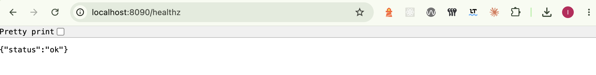

**Screenshot — GET /metrics exposing Prometheus data:**

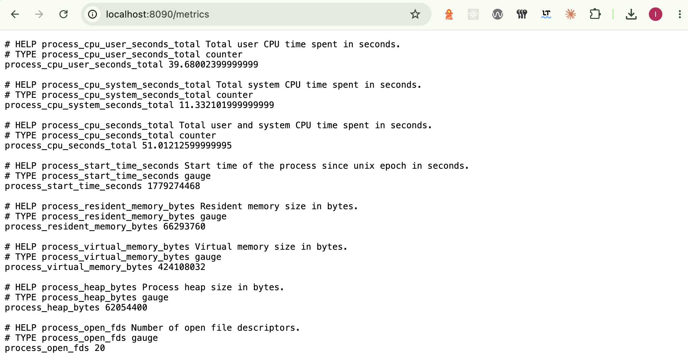

### The Dockerfile

For the Dockerfile I chose `node:20-alpine` as the base image. Alpine is a minimal Linux distribution — the image is around 130 MB total instead of ~950 MB for `node:latest` which is based on Debian. Less packages = less attack surface = less vulnerabilities.

I also made sure to:
- Copy `package*.json` first and run `npm install --only=production` before copying the rest of the code. This is a Docker caching trick : if I only change `app.js`, Docker reuses the cached `npm install` layer and the build is much faster.
- Run the app as a non-root user (`appuser`) — running as root inside a container is a bad practice.
- Add a `HEALTHCHECK` on `/healthz` so Docker knows when the container is actually ready.
- Add a `.dockerignore` to exclude `node_modules`, `.env` and `.git` from the build context.

---

## Part 2 — Private Registry

Instead of using Docker Hub, I set up my own private registry running locally. It uses the official `registry:2` image and a web UI (`joxit/docker-registry-ui`) to browse images visually.

The registry runs in its own separate Compose file so it can stay up independently of the main stack.

```bash
# Start the registry
docker compose -f docker-compose.registry.yml --env-file .env up -d

# Build the API image and push it to the private registry
docker build -t localhost:5001/mon-api:1.0.0 ./api
docker push localhost:5001/mon-api:1.0.0
```

**Screenshot — Building the API image:**

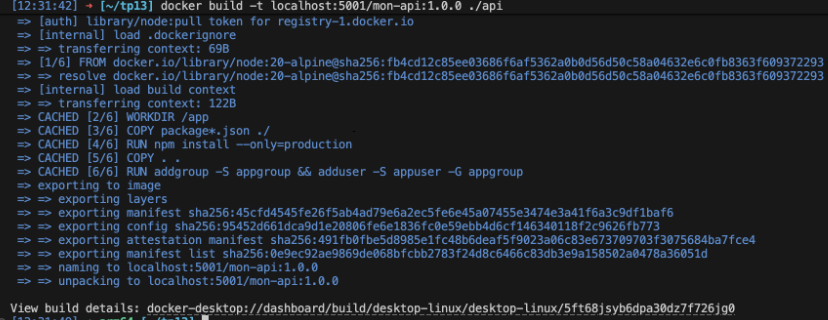

**Screenshot — Pushing the image to the private registry:**

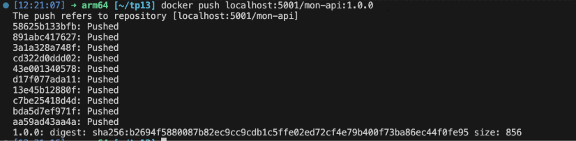

**Screenshot — Registry UI at http://localhost:8080 showing the image:**

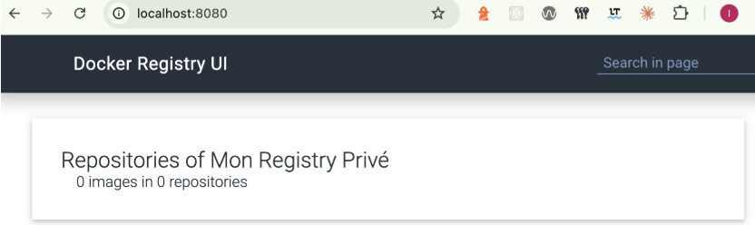

The `docker-compose.yml` uses `localhost:${REGISTRY_PORT}/mon-api:1.0.0` as the image, so it always pulls from my private registry.

---

## Part 3 — Compose Stack and Nginx

The main `docker-compose.yml` runs three services on a custom Docker network I called `internal`:

| Service | PET variable | Port visible to host |
|---------|-------------|----------------------|
| `cat` | `cat` | none — internal only |
| `dog` | `dog` | none — internal only |
| `nginx` | — | `${NGINX_PORT}:80` |

`cat` and `dog` don't expose any ports directly. The only way to reach them is through Nginx. Nginx listens on port 8090 (configured via `.env`) and routes traffic like this:

- `GET /` — round-robin between `cat` and `dog` (load balancing)
- `GET /cat` — always goes to the `cat` container only
- `GET /dog` — always goes to the `dog` container only

Nginx also waits for both `cat` and `dog` to be healthy before starting, using `depends_on` with `condition: service_healthy`.

**Screenshot — API response at http://localhost:8090:**

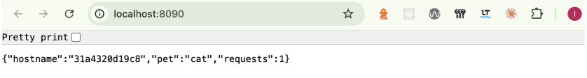

---

## Part 4 — Security

### No hardcoded values

Everything that can be configured is in the `.env` file. Nothing is hardcoded in `docker-compose.yml` or the Dockerfile:

```env
API_PORT=3000
PET_CAT=cat
PET_DOG=dog
NGINX_PORT=8090
GRAFANA_PORT=3001
PROMETHEUS_PORT=9091
REGISTRY_PORT=5001
REGISTRY_UI_PORT=8080
PORTAINER_PORT=9001
GRAFANA_PASSWORD=admin
```

### Scanning with Trivy

I scanned the image with Trivy to check for known vulnerabilities:

```bash
trivy image localhost:5001/mon-api:1.0.0
```

**Screenshot — Trivy scan output:**

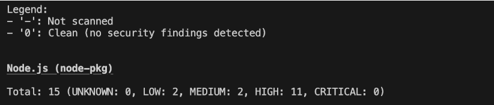

The result is **0 CRITICAL CVEs**. There are some LOW and MEDIUM ones in Node.js packages but nothing critical. This is exactly why I chose `node:20-alpine` over `node:latest` — Debian-based images ship with many more packages and usually report dozens of HIGH and CRITICAL CVEs just from system libraries that are not even used by the app.

---

## Part 5 — Validating the Stack

Once everything is running, I checked that each requirement from the evaluation works:

**Screenshot — `docker compose ps` showing all services Up and healthy:**

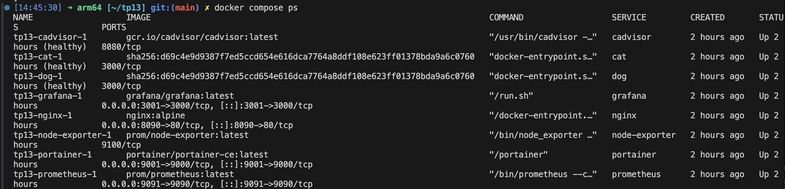

**Screenshot — Load balancing working: hostnames alternate between the two containers. `/cat` always returns `pet: cat`, `/dog` always returns `pet: dog`, and the counters are different between the two services:**

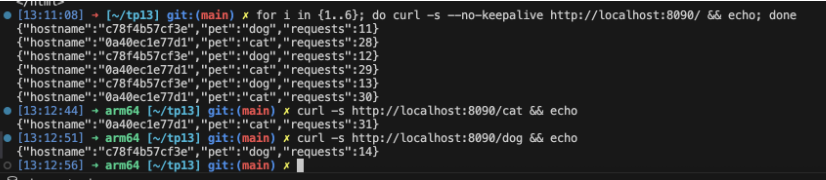

---

## Part 6 — Theoretical Questions

### Docker Swarm — `docker compose up` vs `docker stack deploy`

`docker compose up` is a local tool. It runs containers on a single machine using a `docker-compose.yml` file. It is perfect for development but not for production at scale.

`docker stack deploy` is for **Docker Swarm** — a cluster of multiple machines. It distributes services across nodes, handles automatic restarts if a container crashes, and supports rolling updates with zero downtime.

**Why can't `build:` be used in Swarm?**

When Swarm schedules a service, it can run it on any machine in the cluster. Worker nodes don't have access to the source code — they can only pull pre-built images from a registry. The `build:` directive needs the source code to be present locally. So the right workflow is: build the image → push it to a registry → reference it with `image:` in the stack file.

---

### Docker Secrets vs environment variables

**Environment variable:**
Stored in plain text in the container config. Visible with `docker inspect`. If someone gets access to the host, they can read all env vars easily. Fine for non-sensitive config, bad for passwords.

**Docker Secret:**
A Swarm-native feature. The secret is encrypted in transit and at rest. It is never stored as an env var — instead it appears as a file inside the container at `/run/secrets/<secret-name>`. Even with `docker inspect` you cannot read it.

**Reading a secret in Node.js:**
```js
const fs = require('fs');
const dbPassword = fs.readFileSync('/run/secrets/db_password', 'utf8').trim();
```

---

### What to back up in production

If the server dies, here is what I cannot recover automatically:

| What | Examples | Why it is irreplaceable |
|------|----------|------------------------|
| Named volumes | Grafana data, Prometheus data, registry images | Created at runtime, not in Git |
| Secret config | `.env` with real passwords, TLS certificates | Not in Git by design |

What I can recreate automatically (no backup needed):

| What | Why |
|------|-----|
| Docker images | Rebuilt by CI/CD from Dockerfiles |
| Containers | Ephemeral by design |
| Config files | Already in Git (`docker-compose.yml`, `nginx/default.conf`, etc.) |

**Backup command for a named volume:**
```bash
docker run --rm -v tp13_grafana-data:/data alpine tar czf - /data > grafana-backup.tar.gz
```

---

## Part 7 — Observability and Production

To monitor the stack I added four extra services in `docker-compose.yml`:

| Service | Port | What it does |
|---------|------|--------------|
| **Prometheus** | 9091 | Scrapes metrics from the API (`/metrics`), from node-exporter and cAdvisor |
| **Grafana** | 3001 | Displays dashboards — auto-provisioned, no manual setup needed |
| **node-exporter** | internal | Host CPU, memory, disk metrics |
| **cAdvisor** | internal | Per-container CPU and memory usage |
| **Portainer** | 9001 | Web UI to manage Docker containers |

Grafana is fully provisioned automatically. I didn't have to log in and click anything. It picks up the datasource and dashboard from files in `monitoring/grafana/provisioning/` and `monitoring/grafana/dashboards/`. Those files are versioned in the repo so anyone who clones the project gets the same dashboard.

For production, I created `docker-compose.prod.yml` which adds CPU and RAM limits to every service using `deploy.resources`. Run it like this:

```bash
docker compose -f docker-compose.yml -f docker-compose.prod.yml up -d
```

**Screenshot — Prometheus UI at http://localhost:9091:**

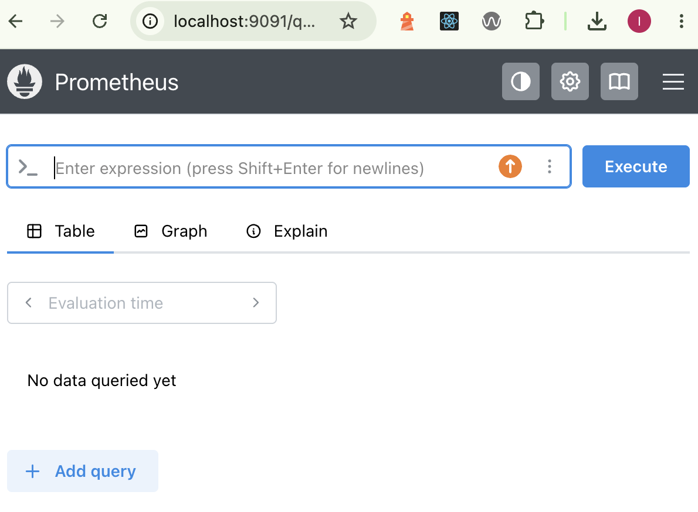

**Screenshot — Grafana dashboard showing API request metrics and memory usage:**

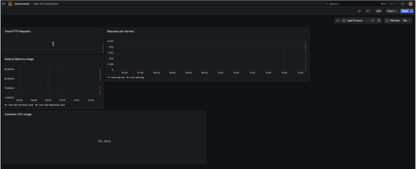

**Screenshot — Portainer at http://localhost:9001:**

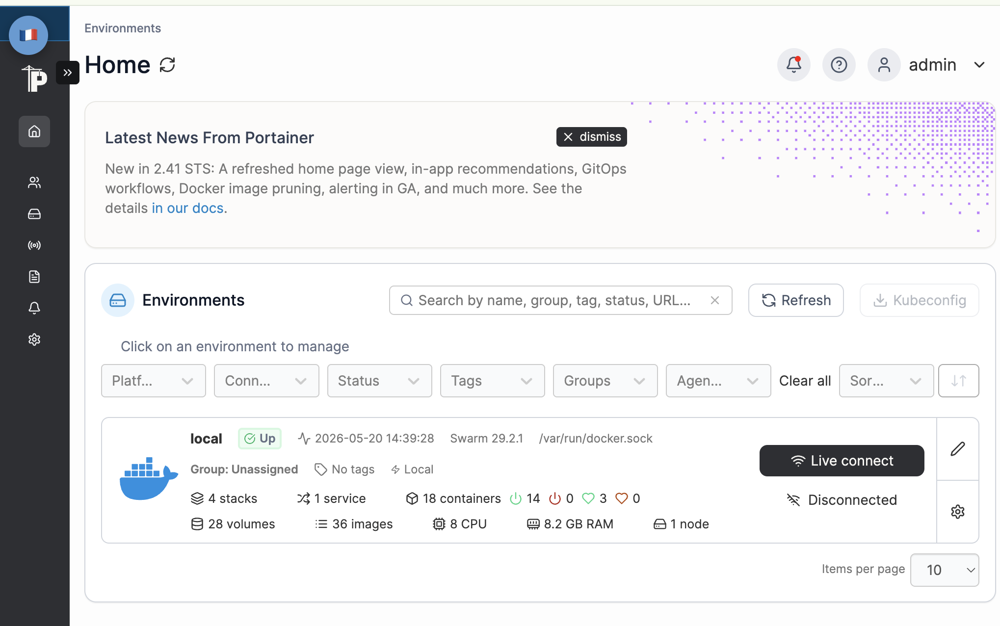

---

## Part 8 — Volumes

I used two types of volume mounts in this project:

**Named volumes** — Docker manages them. Used for data that must survive container restarts:

| Volume | Service | What it stores |
|--------|---------|----------------|
| `prometheus-data` | prometheus | All scraped metrics (time series) |
| `grafana-data` | grafana | Dashboards, users, alert config |
| `portainer-data` | portainer | Portainer internal state |
| `registry-data` | registry | All pushed Docker images |

**Bind mounts** — I control the file on the host. Used for config files that are versioned in Git:

| File on my machine | Path inside container | Service |
|--------------------|-----------------------|---------|
| `./nginx/default.conf` | `/etc/nginx/conf.d/default.conf` | nginx |
| `./monitoring/prometheus.yml` | `/etc/prometheus/prometheus.yml` | prometheus |
| `./monitoring/grafana/provisioning` | `/etc/grafana/provisioning` | grafana |
| `./monitoring/grafana/dashboards` | `/var/lib/grafana/dashboards` | grafana |

The logic is simple: if the data is created at runtime (like Grafana saving a new dashboard), use a named volume. If the data is a config file I write myself, use a bind mount so it stays in Git.

**Screenshot — `docker volume ls` listing all the named volumes:**

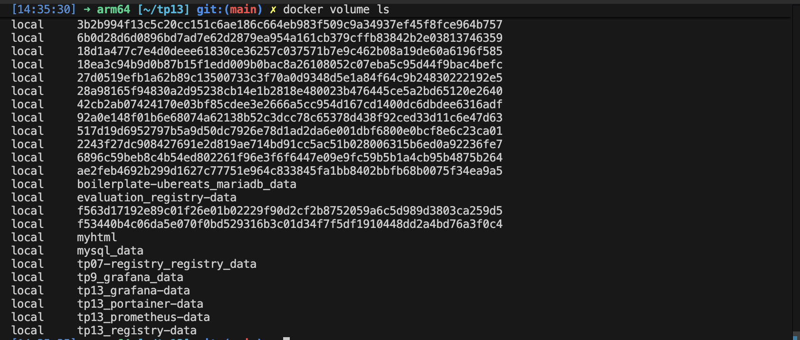

**Screenshot — `docker volume inspect tp13_grafana-data`:**

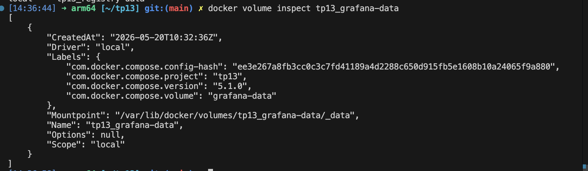

---

## Part 9 — CI/CD with GitHub Actions

I set up a GitHub Actions workflow at `.github/workflows/docker.yml` that runs automatically on every push to `main`. It does four things in order:

1. **Build** the Docker image from `./api`
2. **Scan** it with Trivy — if any CRITICAL CVE is found, the pipeline fails and the image is not pushed
3. **Login** to GitHub Container Registry (ghcr.io) using the automatic `GITHUB_TOKEN` — no extra secrets to configure
4. **Push** the image with a tag based on the short Git SHA: `ghcr.io/ianaliti/mon-api:git-<sha>`

**Screenshot — GitHub Actions pipeline passing:**


---

## Part 10 — VPS Deployment

The full stack is deployed on a VPS at **http://78.138.58.14**.

The API is publicly accessible through Nginx on port 80. The internal services (Grafana, Prometheus, Portainer) are running but their ports are not open to the internet — only port 80 goes through the firewall. This is better from a security perspective.

**Screenshot — `docker compose ps` on the VPS showing all services Up and healthy:**


